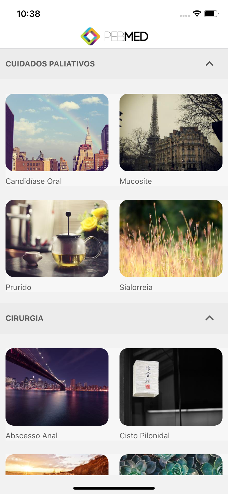
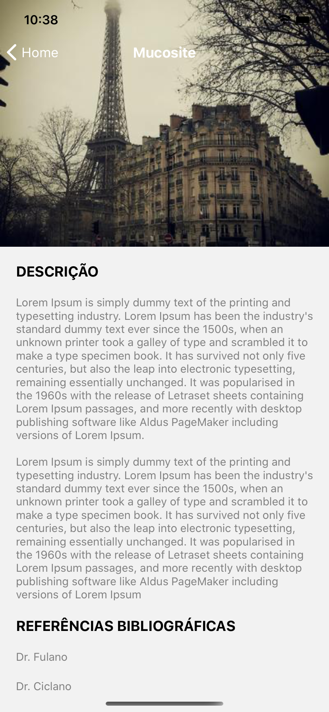

# PEBMED CHALLENGE

Desafio promovido pela **PEBMED** para desenvolvedores React Native

A aplicação utiliza os Seguites Frameworks:

**Axios** para requisições de rede.  
**react-redux, redux e redux-thunk** para o gerênciamento de estados.  
**redux-persist** para persistência de dados offline.  
**react-navigation** para rotas e navegação.  
**react-native-vector-icons** para utilização de fontes especiais.  
**react-native-fast-image** para o cache de imagens.  

# Layout

Foi implementado o layot proposto na documentação do desafio

    
    

